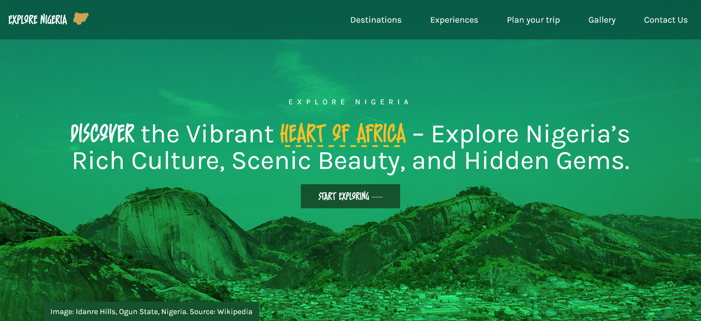

# Explore Nigeria

Explore Nigeria, a visually engaging React application designed to highlight the cultural, historical, and natural beauty of Nigeria. This project serves as a travel and information platform for users to discover Nigeria's landscapes, festivals, cuisine, and popular destinations.

---

## Table of Contents

- [About the Project](#about-the-project)
- [Features](#features)
- [Demo](#demo)
- [Technologies Used](#technologies-used)

---

## About the Project

Nigeria is a country filled with diverse cultures, breathtaking landscapes, and rich traditions. **Explore Nigeria** brings all this together in a user-friendly web experience, making it easy for users to explore and learn more about this beautiful country.

---

## Features

- **Interactive Gallery**: A gallery featuring Nigeria's landscapes, cultural highlights, and notable events.
- **Responsive and Accessible Design**: Optimized for all devices, from desktops to mobile phones.
- **Easy Navigation**: Clear structure and navigation to guide users through content on Nigeria's culture and landmarks.

---

## Demo

View the live demo here: [Explore Nigeria on Vercel App](https://explore-nigeria.vercel.app/)

---

## Technologies Used

- **React**
- **TailwindCSS**
- **Framer Motion**
- **React Router**

---

